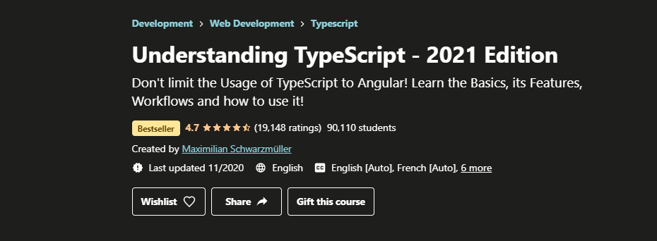

# TypeScript

## [Understanding TypeScript 2021](https://www.udemy.com/course/understanding-typescript/)

<b> Created by Maximillian </b> 
<i> 15 hours </i>
 
 
 

Section | Name  | Duration(min)
----|------------------| ---------
01 | Getting Started  | 41
02 | Basics | 101
03 | Compiler | 55
04 | Javascript & TypeScript | 32
05 | Classes & Interfaces | 96
06 | Advanced Types | 52
07 | Generics | 52
08 | Decorators | 77
09 | Drag&Drop Project I | 161
10 | Modules & Namespace | 50
11 | Webpack | 33
12 | 3 party Libraries | 30
13 | Select&Share Project II | 27
14 | React & Typescript | 45
15 | Node.js & Typescript | 43
16 | BONUS: RoundUP | 03