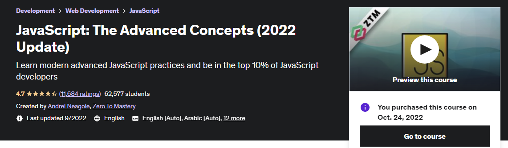

# TypeScript and Javascript

## [Understanding TypeScript 2021](https://www.udemy.com/course/understanding-typescript/)

<b> Created by Maximillian </b> 
<i> 15 hours </i>
 
 
 

Section | Name  | Duration(min)
----|------------------| ---------
01 | Getting Started  | 41
02 | Basics | 101
03 | Compiler | 55
04 | Javascript & TypeScript | 32
05 | Classes & Interfaces | 96
06 | Advanced Types | 52
07 | Generics | 52
08 | Decorators | 77
09 | Drag&Drop Project I | 161
10 | Modules & Namespace | 50
11 | Webpack | 33
12 | 3 party Libraries | 30
13 | Select&Share Project II | 27
14 | React & Typescript | 45
15 | Node.js & Typescript | 43
16 | BONUS: RoundUP | 03
 
 

## [JavaScript: The Advanced Concepts (2022 Update)](https://www.udemy.com/course/advanced-javascript-concepts/)

<b> Created by Andrei Neagoie </b> 
<i> 25 hours </i>
 
 
 

Section | Name  | Duration(min)
----|------------------| ---------
01 | Introduction  | 12
02 | Appendix I: Javascript Basics | 159
03 | Appendix II: Javascript Intermediate | 198
04 | Javascript Foundation | 108
05 | Javascript Foundation II | 151
06 | Types in Javascript | 69
07 | 2 Pillars: Closure and Prototypal Inheritance | 149
08 | Object Oriented Programming | 108
09 | Functional Programming | 115
10 | OOP vs FP | 26
11 | Asynchronous | 117
12 | Modules | 53
13 | Error Handling | 43
14 | Extra: Data structures in Javascript | 173
